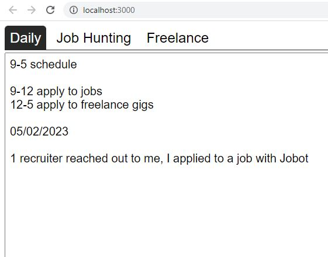

05/04/2023

9:34 AM

this might be another waste of time but I'm tempted to make a local (just for me) job aggregator

it would be in the form of a chrome extension (assuming it can work while tab is inactive) then go through a script to navigate the page/scrape it.

Then put them in a local database for me to view locally as a pool

One of those waste of time things... I can do other things, practice technologies/do some leet/dsa/system design stuff

I did fix up some overflow stuff real quick

---

05/03/2023

9:40 AM

Ahh man... the feeling of dread, nice to wake up to it

What do I want right now? An overview of all the jobs I applied to/statuses

I need to try more, apply and land freelance roles, start generating income

I will also sell more of my stuff as time goes on/get more desperate

10:06 AM

I'm going slow fear is in my mind

math just doesn't work out, need the monies

10:29 AM

making progress, have to finish this today since it's a waste of time doing this vs. applying

10:40 AM

distracted

10:44 AM

still distracted

11:06 AM

slowing down... fear/dread in my mind

11:16 AM

the problem is I'm not moving forward... no interviews

11:43 AM

have a usable interface, not editable yet though

doing a workout break and food, will continue on this to make it editable but after that will start applying

12:02 PM

back on, going to add editable

12:27 PM

initially I was going for editable rows but harder than just a modal

I have to apply to stuff today so I will stop this soon once I can edit/modify without directly changing the data (localStorage)

12:52 PM

quick break

1:24 PM

back on

1:38 PM

working edit mode, no delete, going to stop here for today

have not touched freelance yet, should be able to add that quickly/use the same code (copy sucks, not planned)

3:25 PM

ahh man have not applied...

what's the laziest way I can copy the job hunting code into freelance, it's the same thing just stored on its own

3:35 PM

I'm screwing around with my pbp, got Manjaro working on it again thankfully

3:45 PM

alright lazy get this done

there we go, absolutely lazy pos got it done, mind is spent now

need to start applying

3:50 PM

well it's ugly but it works

3:54 PM

oh yeah let me package it and see what happens... I'm concerned about local storage, right now using localhost:3000 "domain" to save against

but maybe they're all the same since not sessionStorage... it seems to be per domain

ehh I could build it but if rebuilding/redploying wipes the state that could be bad, I'll find out

4:03 PM

yeah doesn't seem like you're supposed to be able to use localStorage easily with Electron, need to use something

maybe I need the window call

well... I'll just deploy it on a local server for now unless I upgrade the data store (api)

---

05/02/2023

8:16 AM

Thankfully I reset my sleep pattern so I got up by 7AM naturally.

I sold my Remarkable 2 so I'm using a piece of paper/pencil I'm sad.

But I've got the Pinetab 2 coming, won't matter if I'm homeless lmao. It is inferior comparably regarding drawing expereince due to display tech/pen but yeah. It would auto complete a widget/box vs. just plain drawing... more power but no palm rejection/pressure-tilt detection... so that part sucks.

RM2 you can write code for it with c++/rust/qt... idk... dumbass here left his 6-fig job with no savings.

Anyway this tool is a step up above using google spreadsheet.

What's nice about it is development driven by need

I'm thinking about avoiding using a DB, since local storage works... DB/API just adds more work.

Anyway I have more things to sell... my prized 3080Ti FE WHY!!! so sad, that's alright I have not played video games much lately and my desktop keeps crashing for some reason while playing games, just freezes

I already sold my carbon x1 ooh man that hurt, now using PBP which is brutal (problematic, very underpowered), awful keyboard and trackpad

It can't even wake up from sleep lmao, anyway I need to start

The time off has been great though, unfortunately I dumped a lot of the time into interviews or writing the CBP tax parser, that took me a few days

I watched all of The Walking dead too... 11 seasons man damn

Basics... tab view, main being a daily "what's coming up next" sort of thing

Other tab is job apps... covering applications and freelance (probably separate tabs actually)

Time just keeps moving forward and job interviews and what not take time

how do you manifest money now? sell things

Trying to freelance but the jobs are so bad or high competition

It's like "Build facebook for $50" like thanks

It's evolution baby, I was at the park and saw these baby fish swimming along in a creek, death nearby (birds)

Be the peak ape and adapt, survive

Unfortunately there is still not a lot of things that have grown... few of these and purple flowers

Was a great day though, other than the wind

I'd be working on my ml-hat-cam project right now/getting the video write to USB working and polishing the autofocus so I can fly tomorrow... but need to job hunt.

Okay headphones on let's go, wait need coffee

8:40 AM

I feel good right now though, vibin' present, sleep is nice

8:49 AM

distracted

9:00 AM

ugh... my fingers are oily

9:05 AM

distracted... I had an idea though I can get a refund on my VR backed project if desperate that's like a month of expenses

lol the title of this repo, that one time I got isekaid as a homeless man

It is fun to build something freely from scratch, but also it feels like grunt work

To build all the parts out

Okay for the daily thing, it'll just be a large textarea

Then job-hunting is an actual crud thing tracked by time/status

9:19 AM

distracted, time for the metal

going for ugly but functional

9:40 AM

starting to get going

crazy looking back at LinkedIn/reached out, 16 in Mar, 17 in Apr... all Sr. Tech lead type which is not me

9:49 AM

recruiter just hit me up now, updating burn rate app since it is missing a lot of info

I will note, I should focus on applying vs. making this app (less time applying)

I have been fortunate that I was not in the "applied to 500 jobs heard nothing back" group but maybe now...

10:04 AM

oof... yeah I'm more f'd than I realize

10:10 AM quick snack break

10:27 AM

back on... got off the call with recruiter, will study up for that tech stack

yeah I am like legit f'd if I don't get anything this month... how do I manifest money from my ass? idk

I was so used to that 6fig income living check to check, I was helping out people (giving away 30% of my income every month last 3 years) but didn't focus on paying down debts/investing/making side income... so I will change that going forward

10:38 AM

distracted

I'm gonna have to start making moves in a couple weeks if I still don't have anything

10:50 AM

the whole point of this app is to keep me motivated/on a schedule

the backing thing is non-refundable ha

I'm losing steam

11:09 AM

damn yeah I feel spent already, just going to go apply to stuff, right it in a notepad for now till I design the job hunting tab, will finish building it tomorrow morning

11:17 AM

spent

1:29 PM

did my mini workout, I'm going to get this thing made, the job part at least

to start logging info, since I didn't apply much today/wasted time

1:45 PM

well... maybe I'm trying, maybe have to ship something I sold (oscope) I'm so sad... I never even used it, supposed to learn it
